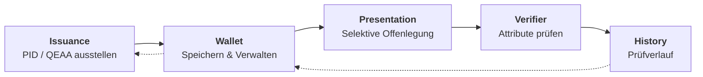
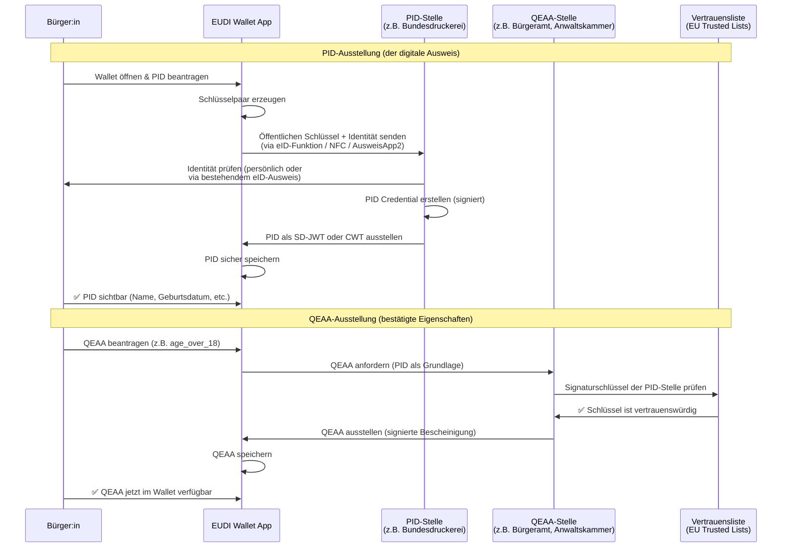

# 🇪🇺 eIDAS 2.0 / EUDI Wallet Demo MVP

**Browser-basierte Simulation des gesamten Lebenszyklus einer EUDI Wallet**


🔗 **Live-Demo:** [**nikrause.github.io/eidas-wallet-demo/**](https://nikrause.github.io/eidas-wallet-demo/)

---

## 🎯 Überblick

Dieses Projekt demonstriert die Kernkonzepte von **eIDAS 2.0** und der **EUDI Wallet (European Digital Identity Wallet)** in einer interaktiven, browser-basierten Simulation.

Die Demo läuft als **clientseitige Svelte-5-App** (ohne SvelteKit) mit optionalem **OpenID4VP Verifier Server** (`server/verifier.py`). Credentials werden kryptografisch via **SD-JWT** (ECDSA P-256) signiert. Sie simuliert den gesamten Lebenszyklus digitaler Identitätsdaten:

> **Ausstellung (Issuance) → Verwaltung (Wallet) → Selektive Offenlegung (Presentation) → Prüfverlauf (History)**

---

## 🗺️ Architektur

### Lebenszyklus




---

## 🔐 Ausstellung in der Realität

### Ausstellungsablauf (Issuance Flow)



### Länderspezifische Ausstellungsdetails

Detaillierte Tabellen pro Land findest du in **[Country Issuance Details →](docs/country-issuance-details.md)**:

- **🇩🇪 Deutschland** — PID via AusweisApp2 / nPA, QEAA für Alter, Beruf (IHK), Bildung
- **🇫🇷 Frankreich** — PID via France Identité / CNIe, QEAA für Alter und Beruf
- **🇧🇪 Belgien** — PID via eID-Karte / Itsme, höchste eID-Akzeptanz Europas
- **🇳🇱 Niederlande** — PID via DigiD / Yivi, Zwei-Spur-Ansatz mit attributbasierter Identität

Die **PID (Personal Identification Data)** ist das Wurzel-Credential — ohne sie kann kein QEAA ausgestellt werden. Alle QEAAs sind mit der PID verknüpft und erben Vertrauenswürdigkeit vom Ausstellungsprozess der PID.

---

## 🧱 Technologie-Stack

| Komponente        | Technologie                                  |
| ----------------- | -------------------------------------------- |
| **Framework**     | [Svelte 5](https://svelte.dev/) (Runes)      |
| **Bundler**       | [Vite 6](https://vitejs.dev/)                |
| **Routing**       | Client-seitig (Hash-basiert)                 |
| **Speicher**      | `localStorage` (Web API)                     |
| **QR-Codes**      | [qrcode](https://www.npmjs.com/package/qrcode) v1.5 |
| **State Mgmt**    | Svelte 5 `$state`, `$derived`, `$effect` Runes |
| **Hosting**       | GitHub Pages / Static                        |

---

## 🚀 Entwicklung starten

```bash
git clone https://github.com/NiKrause/eidas-wallet-demo.git
cd eidas-wallet-demo
npm install
npm run dev
```

Dann `http://localhost:5173` öffnen.

```bash
# Produktions-Build
npm run build
npm run preview
```

### 🚀 Automatisches Deployment

Bei jedem Push auf `main` baut ein **GitHub Actions Workflow** das Projekt automatisch und deployed es auf **GitHub Pages**.

Der Workflow:
1. Checkt das Repository aus
2. Installiert Abhängigkeiten (`npm ci`)
3. Baut das Projekt (`npm run build`)
4. Lädt den `dist/` Ordner als Pages-Artifact hoch
5. Deployt auf `https://nikrause.github.io/eidas-wallet-demo/`

Manuelles Deployment kann über den [Actions Tab](https://github.com/NiKrause/eidas-wallet-demo/actions/workflows/deploy.yml) ausgelöst werden.

### 🧪 E2E-Tests ausführen

```bash
npm test
```

Insgesamt **8 End-to-End-Tests** mit [Playwright](https://playwright.dev/), die den gesamten EUDI-Wallet-Lebenszyklus simulieren:

| # | Test | Was wird geprüft |
|---|------|------------------|
| 1 | **PID ausstellen** | Formular ausfüllen, PID Credential erstellen, Speicherung in `localStorage` prüfen |
| 2 | **QEAA ausstellen** | Altersverifikations-Credential ausstellen, Boolean-Felder und Persistenz prüfen |
| 3 | **Wallet Dashboard** | Credential einspielen, in der Wallet anzeigen, Detail-Modal öffnen und schließen |
| 4 | **Credential löschen** | Über Karte hover, Löschen klicken, Dialog bestätigen, Empty State prüfen |
| 5 | **Presentation & QR** | Credential auswählen, Attribute selektieren, QR-Code generieren, History-Eintrag prüfen |
| 6 | **Verifier** | Beispiel-JSON laden, Verifizieren klicken, Ergebnis inspizieren |
| 7 | **History** | Eintrag vorbelegen, in der Timeline anzeigen, Detail öffnen, alle Einträge löschen |
| 8 | **Full Flow** | PID ausstellen → QEAA ausstellen → Beide in Wallet anzeigen → Selektiv teilen → Verifizieren → History prüfen |

Alle Tests laufen headless in Chromium. Es werden keine Screenshots erstellt. Der Testzustand wird über `localStorage`-Injektion und UI-Interaktion gesteuert.

---

## 📚 Hintergrund: eIDAS 2.0 & EUDI Wallet

Die **eIDAS 2.0-Verordnung** (EU 2024/1183) schafft den Rechtsrahmen für eine **europaweit einheitliche digitale Identität**. Jeder EU-Mitgliedstaat stellt seinen Bürgern eine **EUDI Wallet (European Digital Identity Wallet)** zur Verfügung – eine App, die:

1. **PID (Personal Identification Data)** speichert – die digitalen Ausweisdaten
2. **QEAAs (Qualified Electronic Attestations of Attributes)** verwaltet – qualifizierte Attributsbescheinigungen wie `age_over_18`, `diploma`, `professional_license`
3. **Selektive Offenlegung** ermöglicht – nur die minimal nötigen Daten teilen
4. **OpenID4VP** und **ISO 18013-7** als Protokolle nutzt

### Schlüsselkonzepte

| Konzept | Beschreibung |
|---------|-------------|
| **PID** | Personal Identification Data – Kernidentität (Name, Geburtsdatum, etc.) |
| **QEAA** | Qualified Electronic Attestation of Attributes – bestätigte Eigenschaften (z. B. Alter, Diplom) |
| **PID-Provider** | Staatliche Stelle, die das PID ausstellt (z. B. Bundesdruckerei, ANTS, BOSA) |
| **Selektive Offenlegung** | Nur bestimmte Attribute teilen, nicht das gesamte Credential |
| **Issuance** | Prozess der Ausstellung eines Credentials durch eine vertrauenswürdige Stelle |
| **Presentation** | Prozess der Weitergabe von Credentials/Attributen an einen Verifier |
| **Verifier** | Prüfstelle, die Credentials anfordert und verifiziert |

---

---

## 🏛️ Credential-Widerruf (Revocation)

Eine Kernfunktion jedes Identitätssystems ist die Möglichkeit, Credentials zu **widerrufen**, wenn sie nicht mehr gültig sind – z. B. bei Diebstahl, Namensänderung oder Betrug.

### Wie es in dieser Demo funktioniert

Das **Behörden-Dashboard** (🏛️) simuliert eine ausstellende Behörde. Es zeigt alle ausgestellten Credentials und erlaubt:

1. **Widerruf** mit Grund (gestohlen, verloren, Identitätsänderung, abgelaufen, etc.)
2. **Wiederherstellung** eines zuvor widerrufenen Credentials

### Was passiert beim Widerruf

```
                    ┌──────────────────────┐
                    │  Behörden-Dashboard   │
                    │  🔴 Widerrufen        │
                    └────────┬─────────────┘
                             │
                             ▼
              Status des Credentials → 'revoked'
                             │
              ┌──────────────┼──────────────┐
              ▼              ▼              ▼
       ┌──────────┐  ┌────────────┐  ┌──────────┐
       │  Wallet  │  │  Teilen    │  │ Verifier │
       │ WIDERRUF.│  │  Blockiert │  │ 🔴 FEHLG │
       │   Badge  │  │  Warnung   │  │ schlagen │
       └──────────┘  └────────────┘  └──────────┘
```

| Ansicht | Wirkung |
|---------|---------|
| **Wallet** | Credential-Karte zeigt **WIDERRUFEN**-Badge mit roter Markierung. Detailansicht zeigt Grund und Datum. Löschen-Button ausgeblendet. |
| **Teilen** | Widerrufene Credentials können **nicht geteilt** werden. Statt der Attributauswahl erscheint eine rote Warnung. |
| **Verifier** | Wenn ein Verifier QR-Daten eines widerrufenen Credentials erhält, schlägt die Prüfung **fehl** mit rotem "Credential widerrufen"-Bildschirm. |


---

### In der Praxis

| Mechanismus | Beschreibung |
|-------------|-------------|
| **CRL** (Certificate Revocation List) | Behörde veröffentlicht regelmäßig aktualisierte Liste widerrufener Credential-IDs. Wallets und Verifier laden sie herunter. |
| **OCSP** (Online Certificate Status Protocol) | Echtzeit-Abfrage: Der Verifier fragt "ist dieses Credential noch gültig?" im Moment der Präsentation. |
| **Status List JWT** (RFC 9576) | Aussteller bettet einen Status-Listen-Verweis ins Credential ein. Der Verifier lädt ein kleines JWT zur Statusprüfung. |

### E2E-Tests

```bash
# Nur Revocation-Tests ausführen
npx playwright test revocation.spec.js

# Alle Tests (13 gesamt)
npm test
```

---

## 🔬 Echte OpenID4VP-Integration

Dieses Repository enthält einen **Feature-Branch** `feature/real-openid4vp` (gemerged in `main`), der die Demo
von simuliertem JSON zu **SD-JWT-signierten Credentials** mit ECDSA-Kryptografie weiterentwickelt.

**Phase 1 (SD-JWT-Signierung) ist abgeschlossen** und in `main` gemerged. Der nächste Schritt ist **Phase 2**:
Echte `openid4vp://authorize`-URIs im QR-Code, damit echte Wallet-Apps diese scannen können.

📖 **[Integrationsleitfaden →](docs/real-openid4vp-integration.md)

---

### In dieser Demo (`feature/real-openid4vp` / `main`)

Der QR-Code verwendet jetzt ein **signiertes SD-JWT-Format** (`sd_jwt_vc`) mit ECDSA-P-256-Signaturen. In der Demo ausgestellte Credentials werden kryptografisch signiert und können im Browser verifiziert werden. Zum Testen im selben Browser einfach den **"Verifier öffnen"**-Button auf der QR-Seite klicken.

Die Demo enthält außerdem einen **OpenID4VP Verifier Server** (`server/verifier.py` — Flask) für Tests mit echten Wallet-Apps.

> ⚠️ **Wichtig:** Die QR-Codes dieser Demo verwenden ein **eigenes JSON-Format** um den SD-JWT, keine vollständige `openid4vp://authorize`-URI. Echte nationale Apps wie die **AusweisApp Bund** (Deutschland), **France Identité** oder **Itsme** (Belgien) benötigen das standardisierte OpenID4VP-Protokoll. Dies ist der nächste Meilenstein (Phase 2).

Wer den QR-Code mit einem externen Gerät scannen möchte, kann jede **QR-Code-Scanner-App** verwenden, die Rohtext auslesen kann. Das JSON-Payload wird unter dem QR-Code zur manuellen Kopie angezeigt.

### In der Praxis (Echte EUDI Wallet)

In einer Produktionsumgebung würde der QR-Code eine **OpenID4VP Authorization Request** kodieren – ein standardisiertes Protokoll für verifiable Presentations. Diese QR-Codes müssen mit einer App gescannt werden, die OpenID4VP unterstützt.

#### 🇪🇺 EUDI Wallet Apps & QR-Scanner-Apps

Eine vollständige Tabelle mit nationalen Wallet-Apps (AusweisApp Bund, France Identité, Itsme, Yivi, DigiD, etc.) sowie QR-Scanner-Apps findest du in **[Kompatible Wallet-Apps →](docs/compatible-wallet-apps.md)**. Dort sind auch Verfügbarkeit, Open-Source-Status und Produktionsreife pro EU-Mitgliedstaat aufgeführt.

---

## 📖 Referenzen & Ressourcen

### Europäische Verordnungen & Standards
- [eIDAS 2.0 Verordnung (EU 2024/1183)](https://eur-lex.europa.eu/eli/reg/2024/1183)
- [EUDI Wallet Architecture Reference Framework (ARF)](https://digital-strategy.ec.europa.eu/en/library/eudi-wallet-architecture-and-reference-framework)
- [ISO/IEC 18013-7:2024 — mdL/mdoc für digitale Wallets](https://www.iso.org/standard/82720.html)

### Technische Protokolle
- [OpenID4VP — OpenID for Verifiable Presentations](https://openid.net/specs/openid-4-verifiable-presentations-1_0.html)
- [OpenID4VCI — OpenID for Verifiable Credential Issuance](https://openid.net/specs/openid-4-verifiable-credential-issuance-1_0.html)
- [SD-JWT — Selective Disclosure JWT](https://www.ietf.org/archive/id/draft-ietf-oauth-selective-disclosure-jwt-07.html)
- [W3C Verifiable Credentials Data Model](https://www.w3.org/TR/vc-data-model-2.0/)

### Nationale Umsetzungen
- 🇩🇪 [eID-Wallet / AusweisApp2](https://www.ausweisapp.bund.de/) — Deutschland
- 🇫🇷 [France Identité](https://france-identite.gouv.fr/) — Frankreich
- 🇧🇪 [Itsme](https://www.itsme.be/) — Belgien

### Verwendete Bibliotheken
- [Svelte 5](https://svelte.dev/) — UI-Framework
- [Vite](https://vitejs.dev/) — Build-Tool
- [qrcode](https://www.npmjs.com/package/qrcode) v1.5 — QR-Code Generierung (clientseitig)
- [jose](https://www.npmjs.com/package/jose) v6 — JWT Signierung & Verifikation (SD-JWT via WebCrypto)
- [@sveltejs/vite-plugin-svelte](https://www.npmjs.com/package/@sveltejs/vite-plugin-svelte) — Svelte-Integration für Vite
- [Flask](https://flask.palletsprojects.com/) — OpenID4VP Verifier Server (`server/verifier.py`)
- [Playwright](https://playwright.dev/) — E2E-Testing

---

## 📄 Lizenz

MIT
