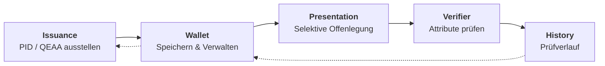
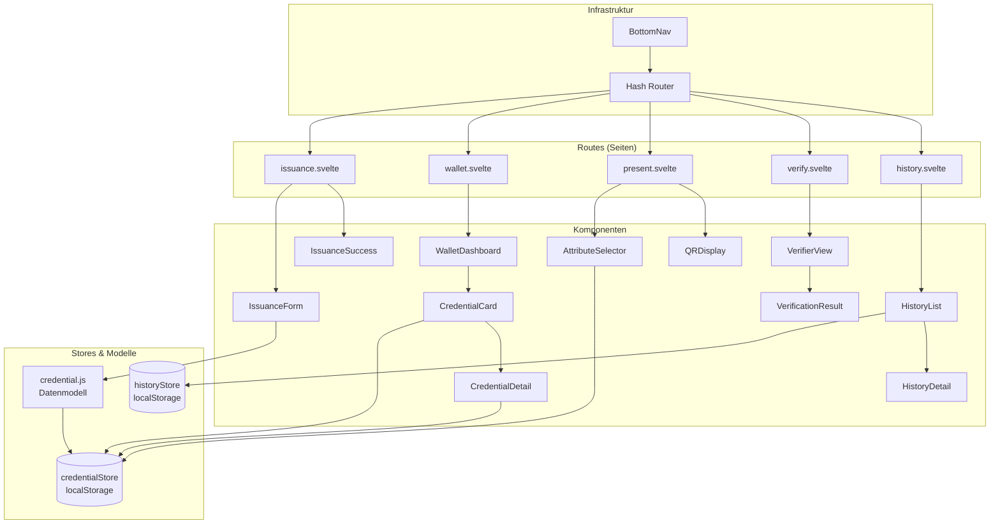
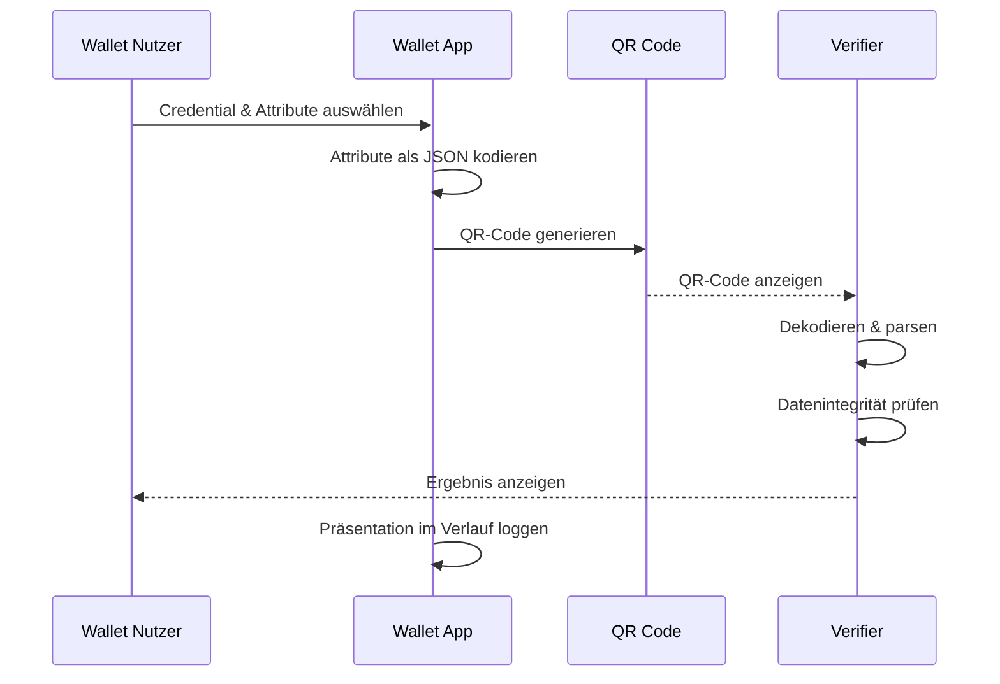

# 🇪🇺 eIDAS 2.0 / EUDI Wallet Demo MVP

**Browser-basierte Simulation des gesamten Lebenszyklus einer EUDI Wallet**


---

## 🎯 Überblick

Dieses Projekt demonstriert die Kernkonzepte von **eIDAS 2.0** und der **EUDI Wallet (European Digital Identity Wallet)** in einer interaktiven, browser-basierten Simulation.

Die Demo läuft **vollständig clientseitig** – kein Server, keine Installation, nur **JavaScript + Svelte 5** (ohne SvelteKit). Sie simuliert den gesamten Lebenszyklus digitaler Identitätsdaten:

> **Ausstellung (Issuance) → Verwaltung (Wallet) → Selektive Offenlegung (Presentation) → Prüfverlauf (History)**

---

## 🗺️ Architektur

### Lebenszyklus



### Komponenten-Architektur



### Datenfluss: Selektive Offenlegung



---

## 🧱 Technologie-Stack

| Komponente        | Technologie                                  |
| ----------------- | -------------------------------------------- |
| **Framework**     | [Svelte 5](https://svelte.dev/) (Runes)      |
| **Bundler**       | [Vite 6](https://vitejs.dev/)                |
| **Routing**       | Client-seitig (eigener Hash-basierter Router)|
| **Speicher**      | `localStorage` (Web API)                     |
| **QR-Codes**      | [qrcode](https://www.npmjs.com/package/qrcode) v1.5 |
| **State Mgmt**    | Svelte 5 `$state`, `$derived`, `$effect` Runes |
| **Hosting**       | GitHub Pages / Static                        |

---

## 🚀 Entwicklung starten

```bash
git clone https://github.com/NiKrause/eidas-wallet-demo.git
cd eidas-wallet-demo
npm install
npm run dev
```

Dann `http://localhost:5173` öffnen.

```bash
# Produktions-Build
npm run build
npm run preview
```

---

## 📚 Hintergrund: eIDAS 2.0 & EUDI Wallet

Die **eIDAS 2.0-Verordnung** (EU 2024/1183) schafft den Rechtsrahmen für eine **europaweit einheitliche digitale Identität**. Jeder EU-Mitgliedstaat stellt seinen Bürgern eine **EUDI Wallet (European Digital Identity Wallet)** zur Verfügung – eine App, die:

1. **PID (Personal Identification Data)** speichert – die digitalen Ausweisdaten
2. **QEAAs (Qualified Electronic Attestations of Attributes)** verwaltet – qualifizierte Attributsbescheinigungen wie `age_over_18`, `diploma`, `professional_license`
3. **Selektive Offenlegung** ermöglicht – nur die minimal nötigen Daten teilen
4. **OpenID4VP** und **ISO 18013-7** als Protokolle nutzt

### Schlüsselkonzepte

| Konzept | Beschreibung |
|---------|-------------|
| **PID** | Personal Identification Data – Kernidentität (Name, Geburtsdatum, etc.) |
| **QEAA** | Qualified Electronic Attestation of Attributes – bestätigte Eigenschaften (z. B. Alter, Diplom) |
| **Selektive Offenlegung** | Nur bestimmte Attribute teilen, nicht das gesamte Credential |
| **Issuance** | Prozess der Ausstellung eines Credentials durch eine vertrauenswürdige Stelle |
| **Presentation** | Prozess der Weitergabe von Credentials/Attributen an einen Verifier |
| **Verifier** | Prüfstelle, die Credentials anfordert und verifiziert |

---

## 📖 Referenzen & Ressourcen

### Europäische Verordnungen & Standards
- [eIDAS 2.0 Verordnung (EU 2024/1183)](https://eur-lex.europa.eu/eli/reg/2024/1183)
- [EUDI Wallet Architecture Reference Framework (ARF)](https://digital-strategy.ec.europa.eu/en/library/eudi-wallet-architecture-and-reference-framework)
- [ISO/IEC 18013-7:2024 — mdL/mdoc für digitale Wallets](https://www.iso.org/standard/82720.html)

### Technische Protokolle
- [OpenID4VP — OpenID for Verifiable Presentations](https://openid.net/specs/openid-4-verifiable-presentations-1_0.html)
- [OpenID4VCI — OpenID for Verifiable Credential Issuance](https://openid.net/specs/openid-4-verifiable-credential-issuance-1_0.html)
- [SD-JWT — Selective Disclosure JWT](https://www.ietf.org/archive/id/draft-ietf-oauth-selective-disclosure-jwt-07.html)
- [W3C Verifiable Credentials Data Model](https://www.w3.org/TR/vc-data-model-2.0/)

### Verwendete Bibliotheken
- [Svelte 5](https://svelte.dev/) — UI-Framework
- [Vite](https://vitejs.dev/) — Build-Tool
- [qrcode](https://www.npmjs.com/package/qrcode) v1.5 — QR-Code Generierung (clientseitig)
- [@sveltejs/vite-plugin-svelte](https://www.npmjs.com/package/@sveltejs/vite-plugin-svelte) — Svelte-Integration für Vite

---

## 📄 Lizenz

MIT
