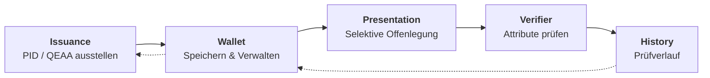
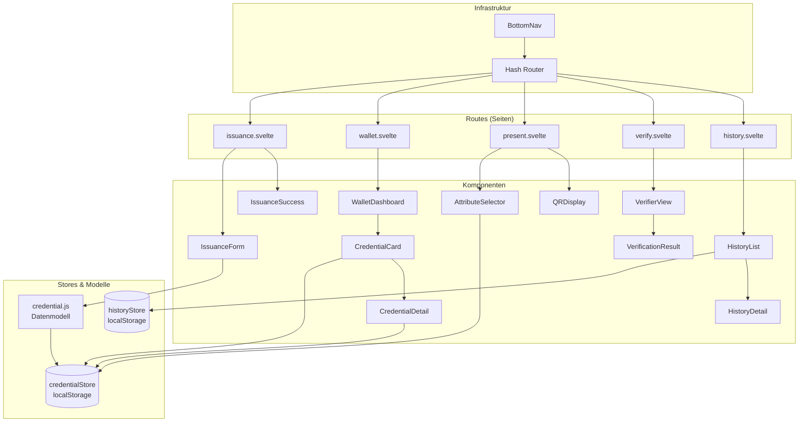
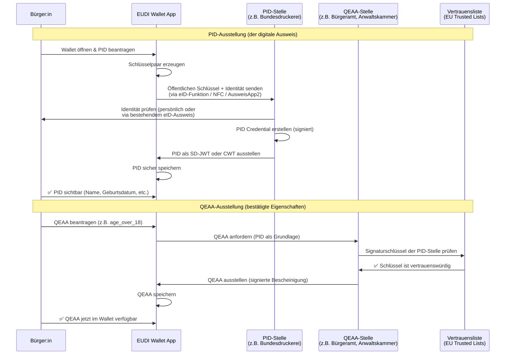

# 🇪🇺 eIDAS 2.0 / EUDI Wallet Demo MVP

**Browser-basierte Simulation des gesamten Lebenszyklus einer EUDI Wallet**


---

## 🎯 Überblick

Dieses Projekt demonstriert die Kernkonzepte von **eIDAS 2.0** und der **EUDI Wallet (European Digital Identity Wallet)** in einer interaktiven, browser-basierten Simulation.

Die Demo läuft **vollständig clientseitig** – kein Server, keine Installation, nur **JavaScript + Svelte 5** (ohne SvelteKit). Sie simuliert den gesamten Lebenszyklus digitaler Identitätsdaten:

> **Ausstellung (Issuance) → Verwaltung (Wallet) → Selektive Offenlegung (Presentation) → Prüfverlauf (History)**

---

## 🗺️ Architektur

### Lebenszyklus



### Komponenten-Architektur



---

## 🔐 Ausstellung in der Realität

### Ausstellungsablauf (Issuance Flow)



### 🇩🇪 Deutschland – Ausstellung

| Credential | Ausstellende Stelle | Schnittstelle | Ablauf |
|---|---|---|---|
| **PID** | **Bundesministerium des Innern (BMI)** via **Bundesdruckerei** | **AusweisApp2** oder eID-Funktion im Wallet | Bürger:innen scannen ihren **neuen Personalausweis (nPA)** oder **elektronischen Aufenthaltstitel (eAT)** per NFC. Der Chip enthält die Identitätsdaten. Die Wallet liest diese lokal – keine Daten werden an einen Server gesendet. Das PID-Credential wird daraus abgeleitet. |
| **QEAA: Altersbestätigung** | **Bürgeramt** vor Ort oder **BMI** online | Persönlicher Besuch oder online via PID | Aus der PID können `age_over_18` / `age_over_21` als selbstausgestellte oder behördlich signierte Bescheinigung abgeleitet werden. Einige QEAAs erfordern einen Besuch im Bürgeramt. |
| **QEAA: Berufszulassung** | **IHK (Industrie- und Handelskammer)**, **Handwerkskammer** oder **Rechtsanwaltskammer** | IHK-Onlineportal oder persönlich | Die Kammer signiert den Berufsstatus. Die Wallet erhält das QEAA via OpenID4VCI. |
| **QEAA: Bildungsabschluss** | **Hochschulen (Universitäten)** via HIS/S3-Systeme | Hochschulportal oder Campus-Karte | Hochschulen stellen digitale Abschlussbescheinigungen aus. |

In Deutschland dient die **eID-Funktion des Personalausweises** (nPA, 27 Mio. aktive eID-Nutzer) als Grundlage. Das **BMJ (Bundesministerium der Justiz)** ist für die Einführung der EUDI Wallet zuständig, mit der **Bundesdruckerei** als technischem Dienstleister. Die deutsche Wallet-Implementierung heißt **"eID-Wallet"** (ehemals "ID Wallet").

**Wichtige URLs:**
- [AusweisApp2](https://www.ausweisapp.bund.de/) — der aktuelle eID-Client
- [Bundesdruckerei eID](https://www.bundesdruckerei.de/de/innovationen/eid) — Betreiber der eID-Infrastruktur
- [BMJ EUDI Wallet](https://www.bmj.de/DE/themen/digitales/eudi_wallet/eudi_wallet_node.html)

### 🇫🇷 Frankreich – Ausstellung

| Credential | Ausstellende Stelle | Schnittstelle | Ablauf |
|---|---|---|---|
| **PID** | **ANTS (Agence Nationale des Titres Sécurisés)** via **France Identité** | **France Identité** App (iOS/Android) | Die **Carte Nationale d'Identité Électronique (CNIe)** enthält einen NFC-Chip. Bürger:innen scannen sie mit der **France Identité** App. Das PID wird aus den Chip-Daten erstellt. |
| **QEAA: Altersbestätigung** | **ANSSI** oder zertifizierte QEAA-Anbieter | France Identité App | Altersbescheinigungen werden aus dem PID abgeleitet. |
| **QEAA: Beruf** | **Ordre des Médecins, Ordre des Avocats** etc. | Portale der Berufskammern | Berufsständische Kammern stellen digitale Bescheinigungen aus. |

Frankreich hat mit **France Identité** bereits ein produktives digitales Identitätssystem. Die **CNIe** (neuer elektronischer Personalausweis, ~15 Mio. Karten) unterstützt NFC-Auslesen.

**Wichtige URLs:**
- [France Identité](https://france-identite.gouv.fr/) — offizielle digitale Identitäts-App
- [ANTS](https://ants.gouv.fr/) — nationale Agentur für Sicherheitsdokumente
- [France Connect](https://franceconnect.gouv.fr/) — bestehender Identitätsverbund

### 🇧🇪 Belgien – Ausstellung

| Credential | Ausstellende Stelle | Schnittstelle | Ablauf |
|---|---|---|---|
| **PID** | **FPS BOSA (Federal Public Service Policy & Support)** via **eID-System** | **Itsme** App oder **eID-Kartenleser** | Der belgische **eID-Ausweis** (seit 2004 für alle Bürger, 11,5 Mio. Karten) ist der etablierteste in Europa. Bürger nutzen einen Kartenleser oder NFC. Die **Itsme** App bietet eine mobile eID. Künftig wird die EUDI Wallet PID aus der bestehenden eID-Infrastruktur abgeleitet. |
| **QEAA: Altersbestätigung** | **BOSA / eID-System** | Itsme App | Belgien bietet bereits kommerziell Altersverifikationsdienste an. |
| **QEAA: Beruf** | **Kruispuntbank (Crossroads Bank)** | Berufsregister-Portale | Belgiens zentrale Register (BCE/KBO) können Berufsbescheinigungen ausstellen. |

Belgien hat die **höchste Akzeptanz digitaler Identitäten in Europa**: Der **eID-Ausweis** ist seit 2004 Pflicht, und **Itsme** hat über 4,5 Mio. aktive Nutzer.

**Wichtige URLs:**
- [Itsme](https://www.itsme.be/) — Belgiens mobile Identitäts-App
- [BOSA eID](https://eid.belgium.be/) — offizielles eID-Portal
- [CSAM](https://www.csam.be/) — Zugangsgateway für den öffentlichen Sektor

---

### Die PID als Fundament

Die **PID (Personal Identification Data)** ist das **Wurzel-Credential** im EUDI-Wallet-Ökosystem:

```
PID (einmalig vom Staat ausgestellt)
   ├── Grundlage für QEAA Altersbestätigung
   ├── Grundlage für QEAA Berufszulassung
   ├── Grundlage für QEAA Bildungsabschluss
   └── Grundlage für jedes zukünftige QEAA
```

Ohne PID kann kein QEAA ausgestellt werden. Die PID repräsentiert die **staatlich verifizierte Identität** des Inhabers. Alle QEAAs sind **mit der PID verknüpft** und erben ihre Vertrauenswürdigkeit vom Ausstellungsprozess der PID.

---

## 🧱 Technologie-Stack

| Komponente        | Technologie                                  |
| ----------------- | -------------------------------------------- |
| **Framework**     | [Svelte 5](https://svelte.dev/) (Runes)      |
| **Bundler**       | [Vite 6](https://vitejs.dev/)                |
| **Routing**       | Client-seitig (Hash-basiert)                 |
| **Speicher**      | `localStorage` (Web API)                     |
| **QR-Codes**      | [qrcode](https://www.npmjs.com/package/qrcode) v1.5 |
| **State Mgmt**    | Svelte 5 `$state`, `$derived`, `$effect` Runes |
| **Hosting**       | GitHub Pages / Static                        |

---

## 🚀 Entwicklung starten

```bash
git clone https://github.com/NiKrause/eidas-wallet-demo.git
cd eidas-wallet-demo
npm install
npm run dev
```

Dann `http://localhost:5173` öffnen.

```bash
# Produktions-Build
npm run build
npm run preview

# E2E-Tests ausführen
npm test
```

---

## 📚 Hintergrund: eIDAS 2.0 & EUDI Wallet

Die **eIDAS 2.0-Verordnung** (EU 2024/1183) schafft den Rechtsrahmen für eine **europaweit einheitliche digitale Identität**. Jeder EU-Mitgliedstaat stellt seinen Bürgern eine **EUDI Wallet (European Digital Identity Wallet)** zur Verfügung – eine App, die:

1. **PID (Personal Identification Data)** speichert – die digitalen Ausweisdaten
2. **QEAAs (Qualified Electronic Attestations of Attributes)** verwaltet – qualifizierte Attributsbescheinigungen wie `age_over_18`, `diploma`, `professional_license`
3. **Selektive Offenlegung** ermöglicht – nur die minimal nötigen Daten teilen
4. **OpenID4VP** und **ISO 18013-7** als Protokolle nutzt

### Schlüsselkonzepte

| Konzept | Beschreibung |
|---------|-------------|
| **PID** | Personal Identification Data – Kernidentität (Name, Geburtsdatum, etc.) |
| **QEAA** | Qualified Electronic Attestation of Attributes – bestätigte Eigenschaften (z. B. Alter, Diplom) |
| **PID-Provider** | Staatliche Stelle, die das PID ausstellt (z. B. Bundesdruckerei, ANTS, BOSA) |
| **Selektive Offenlegung** | Nur bestimmte Attribute teilen, nicht das gesamte Credential |
| **Issuance** | Prozess der Ausstellung eines Credentials durch eine vertrauenswürdige Stelle |
| **Presentation** | Prozess der Weitergabe von Credentials/Attributen an einen Verifier |
| **Verifier** | Prüfstelle, die Credentials anfordert und verifiziert |

---

## 📖 Referenzen & Ressourcen

### Europäische Verordnungen & Standards
- [eIDAS 2.0 Verordnung (EU 2024/1183)](https://eur-lex.europa.eu/eli/reg/2024/1183)
- [EUDI Wallet Architecture Reference Framework (ARF)](https://digital-strategy.ec.europa.eu/en/library/eudi-wallet-architecture-and-reference-framework)
- [ISO/IEC 18013-7:2024 — mdL/mdoc für digitale Wallets](https://www.iso.org/standard/82720.html)

### Technische Protokolle
- [OpenID4VP — OpenID for Verifiable Presentations](https://openid.net/specs/openid-4-verifiable-presentations-1_0.html)
- [OpenID4VCI — OpenID for Verifiable Credential Issuance](https://openid.net/specs/openid-4-verifiable-credential-issuance-1_0.html)
- [SD-JWT — Selective Disclosure JWT](https://www.ietf.org/archive/id/draft-ietf-oauth-selective-disclosure-jwt-07.html)
- [W3C Verifiable Credentials Data Model](https://www.w3.org/TR/vc-data-model-2.0/)

### Nationale Umsetzungen
- 🇩🇪 [eID-Wallet / AusweisApp2](https://www.ausweisapp.bund.de/) — Deutschland
- 🇫🇷 [France Identité](https://france-identite.gouv.fr/) — Frankreich
- 🇧🇪 [Itsme](https://www.itsme.be/) — Belgien

### Verwendete Bibliotheken
- [Svelte 5](https://svelte.dev/) — UI-Framework
- [Vite](https://vitejs.dev/) — Build-Tool
- [qrcode](https://www.npmjs.com/package/qrcode) v1.5 — QR-Code Generierung (clientseitig)
- [@sveltejs/vite-plugin-svelte](https://www.npmjs.com/package/@sveltejs/vite-plugin-svelte) — Svelte-Integration für Vite
- [Playwright](https://playwright.dev/) — E2E-Testing

---

## 📄 Lizenz

MIT
