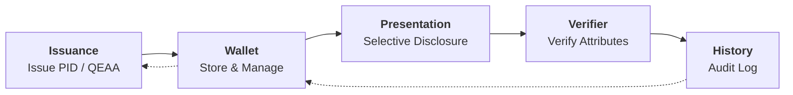
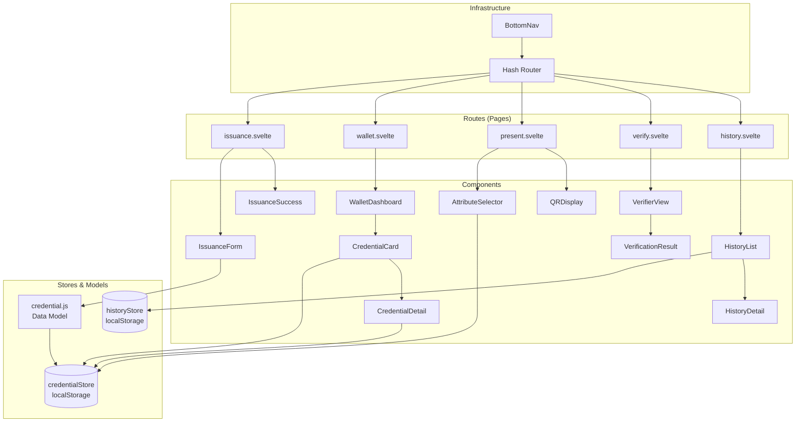
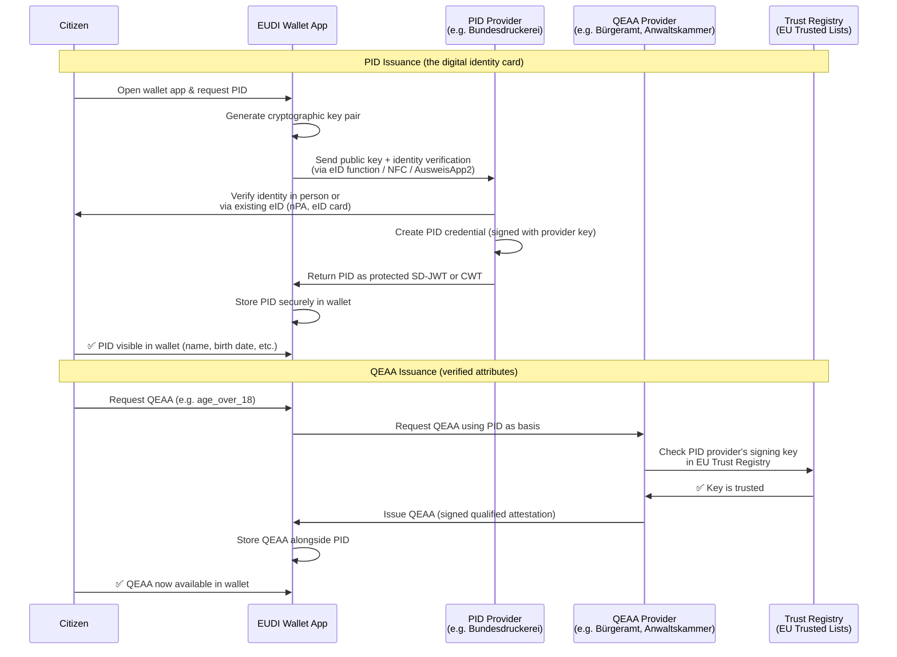

# 🇪🇺 eIDAS 2.0 / EUDI Wallet Demo MVP

**Browser-based simulation of the complete EUDI Wallet lifecycle**


> 🇩🇪 **[Deutsche Version lesen →](README.de.md)**

---

## 🎯 Overview

This project demonstrates the core concepts of **eIDAS 2.0** and the **EUDI Wallet (European Digital Identity Wallet)** through an interactive browser-based simulation.

It runs **entirely client-side** — no server, no installation, just **JavaScript + Svelte 5** (no SvelteKit). The demo simulates the full lifecycle of digital identity credentials:

> **Issuance → Wallet Management → Selective Disclosure → Audit History**

---

## 🗺️ Architecture

### Lifecycle Flow



### Component Architecture



---

## 🔐 Issuance in the Real World

### Issuance Flow



### 🇩🇪 Germany – Issuance

| Credential | Issuing Authority | Interface | How It Works |
|---|---|---|---|
| **PID** | **Federal Ministry of the Interior (BMI)** via **Bundesdruckerei** | The **AusweisApp2** or the wallet's built-in eID function | Citizens scan their **nPA (neuer Personalausweis)** or **eAT (electronic residence permit)** via NFC. The chip contains the identity data. The wallet reads it locally — no data is sent to a server. The PID credential is then derived from this. |
| **QEAA: Age Verification** | **Local Bürgeramt / Citizen's Office** or the **Federal Identity Authority** | In-person visit to Bürgeramt OR fully online | Using the PID, the wallet can derive `age_over_18` / `age_over_21` as a self-issued or authority-signed attestation. Some QEAAs require a visit to the Bürgeramt. |
| **QEAA: Professional License** | **IHK (Chamber of Industry and Commerce)**, **Handwerkskammer**, or **Anwaltskammer (Bar Association)** | IHK online portal or in-person | The chamber signs your professional status. The wallet receives a QEAA via OpenID4VCI. Testing is available via the **IHK Wallet Sandbox**. |
| **QEAA: Educational Attestation** | **Hochschulen (Universities)** via **HIS / S3** systems | University portal or campus card system | Universities issue digital degree attestations. The wallet requests the QEAA via a link from the university's portal. |

In Germany, the **national eID** (nPA, 27 million active eID users) serves as the foundation. The **BMJ (Ministry of Justice)** is tasked with the rollout of the EUDI Wallet, with **Bundesdruckerei** as the technical provider. The German wallet implementation is called **"eID-Wallet"** (formerly "ID Wallet").

**Key URLs:**
- [AusweisApp2](https://www.ausweisapp.bund.de/) — the current eID client
- [Bundesdruckerei eID](https://www.bundesdruckerei.de/de/innovationen/eid) — provider of the eID infrastructure
- [BMJ EUDI Wallet Information](https://www.bmj.de/DE/themen/digitales/eudi_wallet/eudi_wallet_node.html)

### 🇫🇷 France – Issuance

| Credential | Issuing Authority | Interface | How It Works |
|---|---|---|---|
| **PID** | **ANTS (Agence Nationale des Titres Sécurisés)** via **France Identité** | **France Identité** app (iOS/Android) | The **Carte Nationale d'Identité Électronique (CNIe)** contains an NFC chip. Citizens scan it with the **France Identité** app. The PID is created from the chip data. A **L'Identité Numérique (LID)** is provided as a digital proof. |
| **QEAA: Age Verification** | **ANSSI** or certified QEAA providers | France Identité app or partner apps | Similar to Germany, age attestations are derived from the PID. |
| **QEAA: Professional** | **Ordre des Médecins, Ordre des Avocats** etc. | Professional council portals | Professional orders issue digital attestations to their members. |

France already has a **production-ready digital identity** system called **France Identité**. The French **CNIe (new electronic ID card, ~15 million cards)** supports NFC-based reading. France was among the first EU countries to deploy a live wallet.

**Key URLs:**
- [France Identité](https://france-identite.gouv.fr/) — the official digital identity app
- [ANTS](https://ants.gouv.fr/) — national secure documents agency
- [France Connect](https://franceconnect.gouv.fr/) — existing identity federation (precursor to the EUDI Wallet)

### 🇧🇪 Belgium – Issuance

| Credential | Issuing Authority | Interface | How It Works |
|---|---|---|---|
| **PID** | **FPS BOSA (Federal Public Service Policy & Support)** via **eID system** | **Itsme** app or **eID card reader** | Belgium's **eID card** (mandatory for all citizens, 11.5 million cards) is the most established in Europe. Citizens use a card reader or NFC. The **Itsme** app provides a mobile eID. The EUDI Wallet PID will be derived from the existing eID infrastructure. |
| **QEAA: Age Verification** | **BOSA / eID system** | Itsme app | Derived from the eID, Belgium already provides age verification services commercially. |
| **QEAA: Professional** | **Kruispuntbank (Crossroads Bank)** for various professions | Professional registry portals | Belgium's central registries (BCE/KBO) can issue professional attestations. |

Belgium has the **highest adoption of digital identity in Europe**: the **eID card** has been mandatory since 2004, and **Itsme** has over 4.5 million active users. The EUDI Wallet in Belgium builds on this proven infrastructure.

**Key URLs:**
- [Itsme](https://www.itsme.be/) — Belgium's mobile identity app
- [BOSA eID](https://eid.belgium.be/) — official eID portal
- [CSAM](https://www.csam.be/) — public sector identity gateway

---

### The PID is the Foundation

The **PID (Personal Identification Data)** is the **root credential** in the EUDI Wallet ecosystem:

```
PID (issued once by government)
   ├── Basis for QEAA Age Verification
   ├── Basis for QEAA Professional License
   ├── Basis for QEAA Educational Attestation
   └── Basis for any future QEAA
```

Without a PID, no QEAA can be obtained. The PID represents the **government-verified identity** of the holder. All QEAAs are **linked to the PID** and inherit their trust from the PID's issuance process.

---

## 🧱 Tech Stack

| Component         | Technology                              |
| ----------------- | --------------------------------------- |
| **Framework**     | [Svelte 5](https://svelte.dev/) (Runes) |
| **Bundler**       | [Vite 6](https://vitejs.dev/)           |
| **Routing**       | Client-side (hash-based)                |
| **Storage**       | `localStorage` (Web API)                |
| **QR Codes**      | [qrcode](https://www.npmjs.com/package/qrcode) v1.5 |
| **State Mgmt**    | Svelte 5 `$state`, `$derived`, `$effect` Runes |
| **Hosting**       | GitHub Pages / Static                   |

---

## 🚀 Getting Started

```bash
git clone https://github.com/NiKrause/eidas-wallet-demo.git
cd eidas-wallet-demo
npm install
npm run dev
```

Then open `http://localhost:5173`.

```bash
# Production build
npm run build
npm run preview
```

### 🧪 Running the E2E Tests

```bash
npm test
```

This runs **8 end-to-end tests** using [Playwright](https://playwright.dev/) that simulate the complete EUDI Wallet lifecycle:

| # | Test | What it validates |
|---|------|-------------------|
| 1 | **Issue PID** | Fill the issuance form, create a PID credential, verify it's stored in `localStorage` |
| 2 | **Issue QEAA** | Issue an Age Verification credential, verify boolean fields and persistence |
| 3 | **Wallet Dashboard** | Inject a credential, display it in the wallet, open the detail modal, close it |
| 4 | **Delete Credential** | Hover over a credential card, click delete, confirm the dialog, verify empty state |
| 5 | **Presentation & QR** | Select a credential, choose attributes to share, generate a QR code, verify history log |
| 6 | **Verifier** | Load sample JSON data, click verify, inspect the verification result screen |
| 7 | **History** | Pre-populate a history entry, view it in the timeline, open the detail modal, clear all entries |
| 8 | **Full Flow** | Issue PID → Issue QEAA → View both in Wallet → Selectively disclose → Verify → Check History |

All tests run headless in Chromium. No screenshots are taken. Test state is managed via `localStorage` injection and UI interaction.

---

## 📚 Background: eIDAS 2.0 & EUDI Wallet

The **eIDAS 2.0 Regulation** (EU 2024/1183) establishes a legal framework for a **harmonized European digital identity**. Each EU member state provides its citizens with an **EUDI Wallet (European Digital Identity Wallet)** — an app that:

1. **Stores PID (Personal Identification Data)** — digital identity credentials
2. **Manages QEAAs (Qualified Electronic Attestations of Attributes)** — verified attributes like `age_over_18`, `diploma`, `professional_license`
3. **Enables selective disclosure** — share only the minimum required data
4. **Uses OpenID4VP** and **ISO 18013-7** as communication protocols

### Key Concepts

| Concept | Description |
|---------|-------------|
| **PID** | Personal Identification Data — core identity (name, date of birth, etc.) |
| **QEAA** | Qualified Electronic Attestation of Attributes — verified claims (e.g. age, diploma) |
| **PID Provider** | Government authority that issues the PID (e.g. Bundesdruckerei, ANTS, BOSA) |
| **Selective Disclosure** | Share only specific attributes, not the entire credential |
| **Issuance** | Process of a trusted authority issuing a credential into the wallet |
| **Presentation** | Process of sharing credentials/attributes with a verifier |
| **Verifier** | Entity that requests and verifies credentials |

---

---

## 🏛️ Credential Revocation

A key capability of any identity system is the ability to **revoke** credentials when they are no longer valid — e.g. when a device is stolen, identity data changes, or fraud is detected.

### How it works in this demo

The **Authority Dashboard** tab (🏛️) simulates a government issuing authority. It shows all issued credentials and allows you to:

1. **Revoke** a credential with a reason (stolen, lost, identity change, expired, etc.)
2. **Reinstate** a previously revoked credential

### What happens when a credential is revoked

```
                    ┌──────────────────────┐
                    │  Authority Dashboard  │
                    │  🔴 Revoke button     │
                    └────────┬─────────────┘
                             │
                             ▼
              Credential status changes to 'revoked'
                             │
              ┌──────────────┼──────────────┐
              ▼              ▼              ▼
       ┌──────────┐  ┌────────────┐  ┌──────────┐
       │  Wallet  │  │  Present   │  │ Verifier │
       │ REVOKED  │  │  Blocked   │  │ 🔴 FAIL │
       │   badge  │  │  warning   │  │ revoked  │
       └──────────┘  └────────────┘  └──────────┘
```

| View | Effect |
|------|--------|
| **Wallet** | Credential card shows **REVOKED** badge with red styling. Detail view shows revocation reason and date. Delete button is hidden. |
| **Present** | Revoked credentials are **blocked** from being shared. A red warning is shown instead of the attribute selection. |
| **Verifier** | If a verifier receives a revoked credential's QR data, verification **fails** with a red "Credential Revoked" screen showing the reason and revocation authority. |

### In the Real World

In production eIDAS 2.0 systems, revocation would use one of these mechanisms:

| Mechanism | Description |
|-----------|-------------|
| **CRL** (Certificate Revocation List) | Authority publishes a periodically updated list of revoked credential IDs. Wallets and verifiers download and cache it. |
| **OCSP** (Online Certificate Status Protocol) | Real-time lookup: the verifier asks the authority "is this credential still valid?" at the moment of presentation. |
| **Status List JWT** (RFC 9576) | The issuer embeds a status list reference in the credential. The verifier fetches a small JWT to check the credential's status position. |

### E2E Tests

```bash
# Run revocation-specific tests
npx playwright test revocation.spec.js

# Run all tests (13 total)
npm test
```

---

### In this Demo

The QR code generated in this demo uses a **simplified JSON format** (`eidas-wallet-demo-v1`), not a real cryptography-secured protocol. For testing the demo flow in a single browser, use the **"Open Verifier"** button on the QR display page — it navigates to the built-in Verifier tab.

If you want to scan the QR code with an external device, any **QR code scanner app** that can read raw text will work. The JSON payload is displayed below the QR code for manual copying.

### In Production (Real EUDI Wallet)

In a production eIDAS 2.0 environment, the QR code would encode an **OpenID4VP Authorization Request** — a standardized protocol for verifiable presentations. These QR codes must be scanned with an app that supports OpenID4VP.

#### 🇪🇺 EUDI Wallet Apps

When real EUDI Wallets become mandatory (expected 2026–2027), each EU member state will provide an official wallet app. These will be able to scan OpenID4VP QR codes natively.

| Region | Wallet App | Availability |
|--------|-----------|-------------|
| **Germany** | **eID-Wallet** (formerly ID Wallet) by Bundesdruckerei | [Google Play](https://play.google.com/store/apps/details?id=de.bundesdruckerei.eid_wallet) · [App Store](https://apps.apple.com/de/app/eid-wallet/id6476664284) |
| **Germany** | **AusweisApp2** (current eID client) | [Google Play](https://play.google.com/store/apps/details?id=com.bundesdruckerei.ausweisapp2) · [App Store](https://apps.apple.com/de/app/ausweisapp2/id948644063) |
| **France** | **France Identité** | [Google Play](https://play.google.com/store/apps/details?id=com.franceidentite.android) · [App Store](https://apps.apple.com/fr/app/france-identit%C3%A9/id1548611712) |
| **Belgium** | **Itsme** (pre-EUDI, OpenID4VP compatible) | [Google Play](https://play.google.com/store/apps/details?id=be.bmid.itsme) · [App Store](https://apps.apple.com/be/app/itsme/id1186327436) |
| **EU level** | **EUDI Wallet Reference Implementation** (open source) | [GitHub](https://github.com/eu-digital-identity-wallet) |

#### Third-party QR Scanner Apps

For testing purposes, any general-purpose QR scanner app can display the raw JSON content:

| App | Platform | Store Link |
|-----|----------|-----------|
| **QR & Barcode Scanner** (by Gamma Play) | Android | [Google Play](https://play.google.com/store/apps/details?id=com.gamma.scan) |
| **QR Code Reader** (by Scan) | iOS | [App Store](https://apps.apple.com/app/qr-code-reader/id1200318119) |
| **Kaspersky QR Scanner** | Both | [Google Play](https://play.google.com/store/apps/details?id=com.kaspersky.qrscanner) · [App Store](https://apps.apple.com/app/kaspersky-qr-scanner/id1544011972) |

---

## 📖 References & Resources

### European Regulations & Standards
- [eIDAS 2.0 Regulation (EU 2024/1183)](https://eur-lex.europa.eu/eli/reg/2024/1183)
- [EUDI Wallet Architecture Reference Framework (ARF)](https://digital-strategy.ec.europa.eu/en/library/eudi-wallet-architecture-and-reference-framework)
- [ISO/IEC 18013-7:2024 — mdL/mdoc for digital wallets](https://www.iso.org/standard/82720.html)

### Technical Protocols
- [OpenID4VP — OpenID for Verifiable Presentations](https://openid.net/specs/openid-4-verifiable-presentations-1_0.html)
- [OpenID4VCI — OpenID for Verifiable Credential Issuance](https://openid.net/specs/openid-4-verifiable-credential-issuance-1_0.html)
- [SD-JWT — Selective Disclosure JWT](https://www.ietf.org/archive/id/draft-ietf-oauth-selective-disclosure-jwt-07.html)
- [W3C Verifiable Credentials Data Model](https://www.w3.org/TR/vc-data-model-2.0/)

### National Implementations
- 🇩🇪 [eID-Wallet / AusweisApp2](https://www.ausweisapp.bund.de/) — Germany
- 🇫🇷 [France Identité](https://france-identite.gouv.fr/) — France
- 🇧🇪 [Itsme](https://www.itsme.be/) — Belgium

### Libraries Used
- [Svelte 5](https://svelte.dev/) — UI framework
- [Vite](https://vitejs.dev/) — Build tool
- [qrcode](https://www.npmjs.com/package/qrcode) v1.5 — QR code generation (client-side)
- [@sveltejs/vite-plugin-svelte](https://www.npmjs.com/package/@sveltejs/vite-plugin-svelte) — Svelte integration for Vite
- [Playwright](https://playwright.dev/) — E2E testing

---

## 📄 License

MIT
