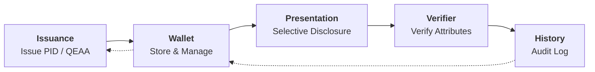
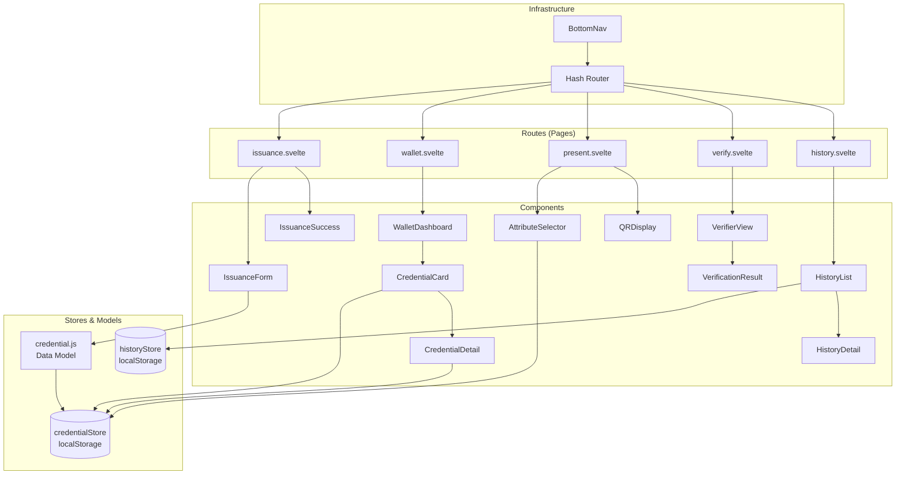
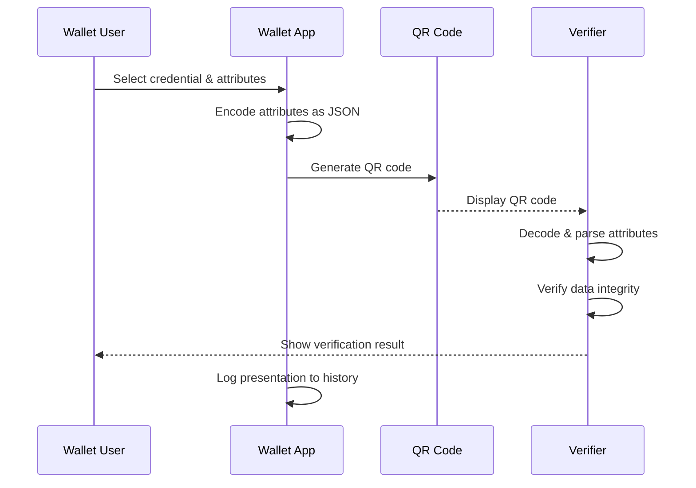

# 🇪🇺 eIDAS 2.0 / EUDI Wallet Demo MVP

**Browser-based simulation of the complete EUDI Wallet lifecycle**


> 🇩🇪 **[Deutsche Version lesen →](README.de.md)**

---

## 🎯 Overview

This project demonstrates the core concepts of **eIDAS 2.0** and the **EUDI Wallet (European Digital Identity Wallet)** through an interactive browser-based simulation.

It runs **entirely client-side** — no server, no installation, just **JavaScript + Svelte 5** (no SvelteKit). The demo simulates the full lifecycle of digital identity credentials:

> **Issuance → Wallet Management → Selective Disclosure → Audit History**

---

## 🗺️ Architecture

### Lifecycle Flow



### Component Architecture



### Data Flow: Selective Disclosure



---

## 🧱 Tech Stack

| Component         | Technology                              |
| ----------------- | --------------------------------------- |
| **Framework**     | [Svelte 5](https://svelte.dev/) (Runes) |
| **Bundler**       | [Vite 6](https://vitejs.dev/)           |
| **Routing**       | Client-side (custom hash-based router)  |
| **Storage**       | `localStorage` (Web API)                |
| **QR Codes**      | [qrcode](https://www.npmjs.com/package/qrcode) v1.5 |
| **State Mgmt**    | Svelte 5 `$state`, `$derived`, `$effect` Runes |
| **Hosting**       | GitHub Pages / Static                   |

---

## 🚀 Getting Started

```bash
git clone https://github.com/NiKrause/eidas-wallet-demo.git
cd eidas-wallet-demo
npm install
npm run dev
```

Then open `http://localhost:5173`.

```bash
# Production build
npm run build
npm run preview
```

---

## 📚 Background: eIDAS 2.0 & EUDI Wallet

The **eIDAS 2.0 Regulation** (EU 2024/1183) establishes a legal framework for a **harmonized European digital identity**. Each EU member state provides its citizens with an **EUDI Wallet (European Digital Identity Wallet)** — an app that:

1. **Stores PID (Personal Identification Data)** — digital identity credentials
2. **Manages QEAAs (Qualified Electronic Attestations of Attributes)** — verified attributes like `age_over_18`, `diploma`, `professional_license`
3. **Enables selective disclosure** — share only the minimum required data
4. **Uses OpenID4VP** and **ISO 18013-7** as communication protocols

### Key Concepts

| Concept | Description |
|---------|-------------|
| **PID** | Personal Identification Data — core identity (name, date of birth, etc.) |
| **QEAA** | Qualified Electronic Attestation of Attributes — verified claims (e.g. age, diploma) |
| **Selective Disclosure** | Share only specific attributes, not the entire credential |
| **Issuance** | Process of a trusted authority issuing a credential into the wallet |
| **Presentation** | Process of sharing credentials/attributes with a verifier |
| **Verifier** | Entity that requests and verifies credentials |

---

## 📖 References & Resources

### European Regulations & Standards
- [eIDAS 2.0 Regulation (EU 2024/1183)](https://eur-lex.europa.eu/eli/reg/2024/1183)
- [EUDI Wallet Architecture Reference Framework (ARF)](https://digital-strategy.ec.europa.eu/en/library/eudi-wallet-architecture-and-reference-framework)
- [ISO/IEC 18013-7:2024 — mdL/mdoc for digital wallets](https://www.iso.org/standard/82720.html)

### Technical Protocols
- [OpenID4VP — OpenID for Verifiable Presentations](https://openid.net/specs/openid-4-verifiable-presentations-1_0.html)
- [OpenID4VCI — OpenID for Verifiable Credential Issuance](https://openid.net/specs/openid-4-verifiable-credential-issuance-1_0.html)
- [SD-JWT — Selective Disclosure JWT](https://www.ietf.org/archive/id/draft-ietf-oauth-selective-disclosure-jwt-07.html)
- [W3C Verifiable Credentials Data Model](https://www.w3.org/TR/vc-data-model-2.0/)

### Libraries Used
- [Svelte 5](https://svelte.dev/) — UI framework
- [Vite](https://vitejs.dev/) — Build tool
- [qrcode](https://www.npmjs.com/package/qrcode) v1.5 — QR code generation (client-side)
- [@sveltejs/vite-plugin-svelte](https://www.npmjs.com/package/@sveltejs/vite-plugin-svelte) — Svelte integration for Vite

---

## 📄 License

MIT
