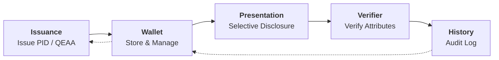
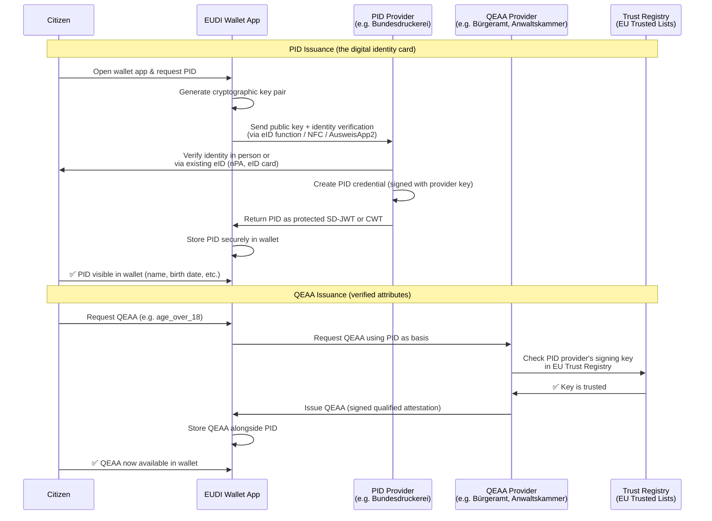

# 🇪🇺 eIDAS 2.0 / EUDI Wallet Demo MVP

**Browser-based simulation of the complete EUDI Wallet lifecycle**


> 🇩🇪 **[Deutsche Version lesen →](README.de.md)**

🔗 **Live Demo:** [**nikrause.github.io/eidas-wallet-demo/**](https://nikrause.github.io/eidas-wallet-demo/)

---

## 🎯 Overview

This project demonstrates the core concepts of **eIDAS 2.0** and the **EUDI Wallet (European Digital Identity Wallet)** through an interactive browser-based simulation.

It runs as a **client-side Svelte 5 app** (no SvelteKit) with optional **OpenID4VP Verifier Server** (`server/verifier.py`). Credentials are cryptographically signed via **SD-JWT** (ECDSA P-256) using the WebCrypto API. The demo simulates the full lifecycle of digital identity credentials:

> **Issuance → Wallet Management → Selective Disclosure → Audit History**

---

## 🗺️ Architecture

### Lifecycle Flow




---

## 🔐 Issuance in the Real World

### Issuance Flow



### Country-Specific Issuance Details

See the **[Country Issuance Details →](docs/country-issuance-details.md)** reference for detailed per-country tables covering:

- **🇩🇪 Germany** — PID via AusweisApp2 / nPA, QEAA for age, professional license (IHK), education
- **🇫🇷 France** — PID via France Identité / CNIe, QEAA for age and professional
- **🇧🇪 Belgium** — PID via eID card / Itsme, highest eID adoption in Europe
- **🇳🇱 Netherlands** — PID via DigiD / Yivi, two-track approach with attribute-based identity

The **PID (Personal Identification Data)** is the root credential — without it, no QEAA can be obtained. All QEAAs are linked to the PID and inherit trust from the PID's issuance process.

---

## 🧱 Tech Stack

| Component         | Technology                              |
| ----------------- | --------------------------------------- |
| **Framework**     | [Svelte 5](https://svelte.dev/) (Runes) |
| **Bundler**       | [Vite 6](https://vitejs.dev/)           |
| **Routing**       | Client-side (hash-based)                |
| **Storage**       | `localStorage` (Web API)                |
| **QR Codes**      | [qrcode](https://www.npmjs.com/package/qrcode) v1.5 |
| **JWT/SD-JWT**    | [jose](https://www.npmjs.com/package/jose) v6 (WebCrypto ECDSA P-256) |
| **Crypto API**    | WebCrypto API (browser-native ECDSA signing) |
| **State Mgmt**    | Svelte 5 `$state`, `$derived`, `$effect` Runes |
| **E2E Testing**   | [Playwright](https://playwright.dev/) — 13 browser + 6 server API tests |
| **OpenID4VP Server** | [Flask](https://flask.palletsprojects.com/) (Python) — `server/verifier.py` (Port 3000) |
| **PID Issuance Server** | [Flask](https://flask.palletsprojects.com/) (Python) — `server/issuer.py` (Port 3001) |
| **Hosting**       | GitHub Pages / Static                   |

---

## 🚀 Getting Started

```bash
git clone https://github.com/NiKrause/eidas-wallet-demo.git
cd eidas-wallet-demo
npm install
npm run dev
```

Then open `http://localhost:5173`.

```bash
# Production build
npm run build
npm run preview
```

### 🚀 Automatic Deployment

On every push to `main`, a **GitHub Actions workflow** automatically builds the project and deploys it to **GitHub Pages**.

The workflow:
1. Checks out the repository
2. Installs dependencies (`npm ci`)
3. Builds (`npm run build`)
4. Uploads the `dist/` folder as a Pages artifact
5. Deploys to `https://nikrause.github.io/eidas-wallet-demo/`

Manual deployment can also be triggered from the [Actions tab](https://github.com/NiKrause/eidas-wallet-demo/actions/workflows/deploy.yml).

### 🧪 Running the E2E Tests

```bash
npm test
# Or run server API tests separately (requires Flask server):
npx playwright test tests/verifier-server.spec.js
```

This runs **13 browser-based + 6 server API tests** using [Playwright](https://playwright.dev/) that cover the complete EUDI Wallet lifecycle:

| # | Test | What it validates |
|---|------|-------------------|
| 1 | **Issue PID** | Fill the issuance form, create a PID credential, verify it's stored in `localStorage` |
| 2 | **Issue QEAA** | Issue an Age Verification credential, verify boolean fields and persistence |
| 3 | **Wallet Dashboard** | Inject a credential, display it in the wallet, open the detail modal, close it |
| 4 | **Delete Credential** | Hover over a credential card, click delete, confirm the dialog, verify empty state |
| 5 | **Presentation & QR** | Select a credential, choose attributes to share, generate a QR code, verify history log |
| 6 | **Verifier** | Load sample JSON data, click verify, inspect the verification result screen |
| 7 | **History** | Pre-populate a history entry, view it in the timeline, open the detail modal, clear all entries |
| 8 | **Full Flow** | Issue PID → Issue QEAA → View both in Wallet → Selectively disclose → Verify → Check History |

All tests run headless in Chromium. No screenshots are taken. Test state is managed via `localStorage` injection and UI interaction.

---

## 📚 Background: eIDAS 2.0 & EUDI Wallet

The **eIDAS 2.0 Regulation** (EU 2024/1183) establishes a legal framework for a **harmonized European digital identity**. Each EU member state provides its citizens with an **EUDI Wallet (European Digital Identity Wallet)** — an app that:

1. **Stores PID (Personal Identification Data)** — digital identity credentials
2. **Manages QEAAs (Qualified Electronic Attestations of Attributes)** — verified attributes like `age_over_18`, `diploma`, `professional_license`
3. **Enables selective disclosure** — share only the minimum required data
4. **Uses OpenID4VP** and **ISO 18013-7** as communication protocols

### Key Concepts

| Concept | Description |
|---------|-------------|
| **PID** | Personal Identification Data — core identity (name, date of birth, etc.) |
| **QEAA** | Qualified Electronic Attestation of Attributes — verified claims (e.g. age, diploma) |
| **PID Provider** | Government authority that issues the PID (e.g. Bundesdruckerei, ANTS, BOSA) |
| **Selective Disclosure** | Share only specific attributes, not the entire credential |
| **Issuance** | Process of a trusted authority issuing a credential into the wallet |
| **Presentation** | Process of sharing credentials/attributes with a verifier |
| **Verifier** | Entity that requests and verifies credentials |

---

---

## 🏛️ Credential Revocation

A key capability of any identity system is the ability to **revoke** credentials when they are no longer valid — e.g. when a device is stolen, identity data changes, or fraud is detected.

### How it works in this demo

The **Authority Dashboard** tab (🏛️) simulates a government issuing authority. It shows all issued credentials and allows you to:

1. **Revoke** a credential with a reason (stolen, lost, identity change, expired, etc.)
2. **Reinstate** a previously revoked credential

### What happens when a credential is revoked

```
                    ┌──────────────────────┐
                    │  Authority Dashboard  │
                    │  🔴 Revoke button     │
                    └────────┬─────────────┘
                             │
                             ▼
              Credential status changes to 'revoked'
                             │
              ┌──────────────┼──────────────┐
              ▼              ▼              ▼
       ┌──────────┐  ┌────────────┐  ┌──────────┐
       │  Wallet  │  │  Present   │  │ Verifier │
       │ REVOKED  │  │  Blocked   │  │ 🔴 FAIL │
       │   badge  │  │  warning   │  │ revoked  │
       └──────────┘  └────────────┘  └──────────┘
```

| View | Effect |
|------|--------|
| **Wallet** | Credential card shows **REVOKED** badge with red styling. Detail view shows revocation reason and date. Delete button is hidden. |
| **Present** | Revoked credentials are **blocked** from being shared. A red warning is shown instead of the attribute selection. |
| **Verifier** | If a verifier receives a revoked credential's QR data, verification **fails** with a red "Credential Revoked" screen showing the reason and revocation authority. |

### In the Real World

| Mechanism | Description |
|-----------|-------------|
| **CRL** (Certificate Revocation List) | Authority publishes a periodically updated list of revoked credential IDs. Wallets and verifiers download and cache it. |
| **OCSP** (Online Certificate Status Protocol) | Real-time lookup: the verifier asks the authority "is this credential still valid?" at the moment of presentation. |
| **Status List JWT** (RFC 9576) | The issuer embeds a status list reference in the credential. The verifier fetches a small JWT to check the credential's status position. |

### E2E Tests

```bash
# Run revocation-specific tests
npx playwright test revocation.spec.js

# Run all tests (13 total)
npm test
```

---

## 🔬 Real OpenID4VP Integration — Complete ✅

All phases of the OpenID4VP integration are **complete** and merged to `main`:

| Phase | What | Status |
|-------|------|--------|
| **1** | SD-JWT credential signing (ECDSA P-256 via WebCrypto + `jose`) | ✅ Done |
| **2** | OpenID4VP Authorization Request URI (`openid4vp://authorize`) via Flask server | ✅ Done |
| **3a** | VerifierView polls server for verification result + fallback to same-browser | ✅ Done |
| **3b** | Server-side VP validation (required fields, format, expiry check) | ✅ Done |
| **4** | E2E server API tests (`tests/verifier-server.spec.js` — 6 tests) | ✅ Done |

📖 **[See the full integration guide →](docs/real-openid4vp-integration.md)  
📖 **[Country issuance details →](docs/country-issuance-details.md)**  
📖 **[Compatible wallet apps →](docs/compatible-wallet-apps.md)**

---

### How it works

When the **Flask server** (`server/verifier.py`) is running on port 3000:

```
Browser (QRDisplay)  ─POST /api/presentation-request──→  Flask Server (:3000)
                     ←── { openid4vp_uri, request_id } ──
                     ── QR encodes openid4vp:// URI  ──→  Real wallet app can scan

Click "Open Verifier":
Browser  ─POST /api/response (with VP token)──→  Flask Server
         ←── { result_id, verified: true/false } ──
         ── polls GET /api/result/{id} ──→  Shows verification result ✅/❌
```

When the server is **not running** (GitHub Pages, E2E tests), the demo **gracefully falls back** to the same-browser JSON flow — credentials are still SD-JWT signed and verifiable.

**Start the server:**
```bash
pip install flask flask-cors pyjwt cryptography
python3 server/verifier.py
```

**Run the API tests (requires server):**
```bash
npx playwright test tests/verifier-server.spec.js
```

#### 🇪🇺 EUDI Wallet Apps & QR Scanner Apps

See the **[Compatible Wallet Apps →](docs/compatible-wallet-apps.md)** reference for a full table of national wallet apps (AusweisApp Bund, France Identité, Itsme, Yivi, DigiD, etc.) and third-party QR scanner apps.

---

## 📖 References & Resources

### European Regulations & Standards
- [eIDAS 2.0 Regulation (EU 2024/1183)](https://eur-lex.europa.eu/eli/reg/2024/1183)
- [EUDI Wallet Architecture Reference Framework (ARF)](https://digital-strategy.ec.europa.eu/en/library/eudi-wallet-architecture-and-reference-framework)
- [ISO/IEC 18013-7:2024 — mdL/mdoc for digital wallets](https://www.iso.org/standard/82720.html)

### Technical Protocols
- [OpenID4VP — OpenID for Verifiable Presentations](https://openid.net/specs/openid-4-verifiable-presentations-1_0.html)
- [OpenID4VCI — OpenID for Verifiable Credential Issuance](https://openid.net/specs/openid-4-verifiable-credential-issuance-1_0.html)
- [SD-JWT — Selective Disclosure JWT](https://www.ietf.org/archive/id/draft-ietf-oauth-selective-disclosure-jwt-07.html)
- [W3C Verifiable Credentials Data Model](https://www.w3.org/TR/vc-data-model-2.0/)

### National Implementations
- 🇩🇪 [AusweisApp2](https://www.ausweisapp.bund.de/) — eID client (nPA reader), not an OpenID4VP wallet
- 🇩🇪 [eID-Wallet](https://www.bundesdruckerei.de/) (Bundesdruckerei) — upcoming EUDI Wallet for Germany, planned 2026–2027
- 🇫🇷 [France Identité](https://france-identite.gouv.fr/) — France
- 🇧🇪 [Itsme](https://www.itsme.be/) — Belgium

### Libraries Used
- [Svelte 5](https://svelte.dev/) — UI framework
- [Vite](https://vitejs.dev/) — Build tool
- [qrcode](https://www.npmjs.com/package/qrcode) v1.5 — QR code generation (client-side)
- [jose](https://www.npmjs.com/package/jose) v6 — JWT signing & verification (SD-JWT via WebCrypto)
- [@sveltejs/vite-plugin-svelte](https://www.npmjs.com/package/@sveltejs/vite-plugin-svelte) — Svelte integration for Vite
- [Flask](https://flask.palletsprojects.com/) — OpenID4VP Verifier Server (`server/verifier.py`)
- [Playwright](https://playwright.dev/) — E2E testing

---

## 📄 License

MIT
