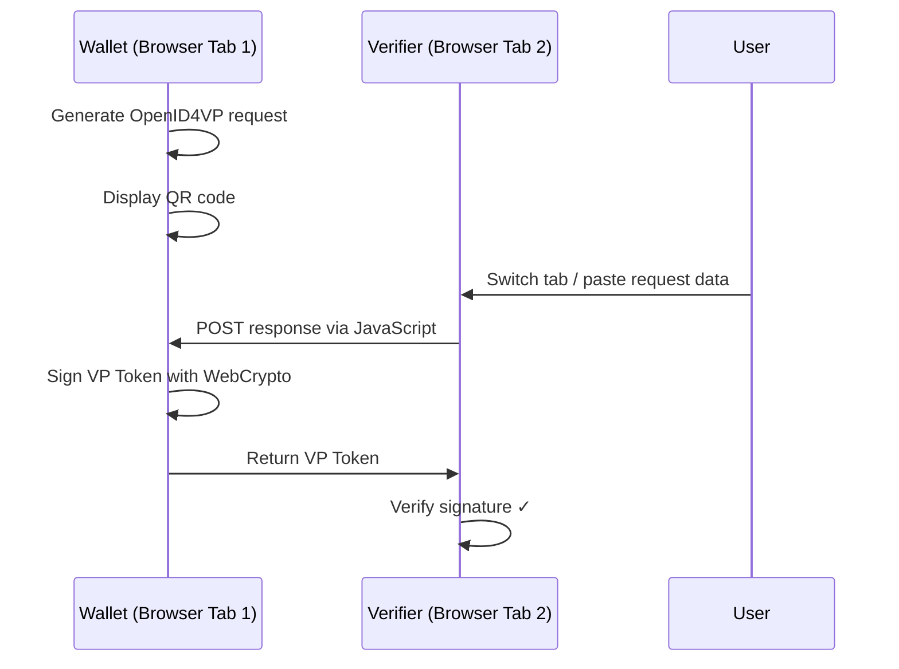
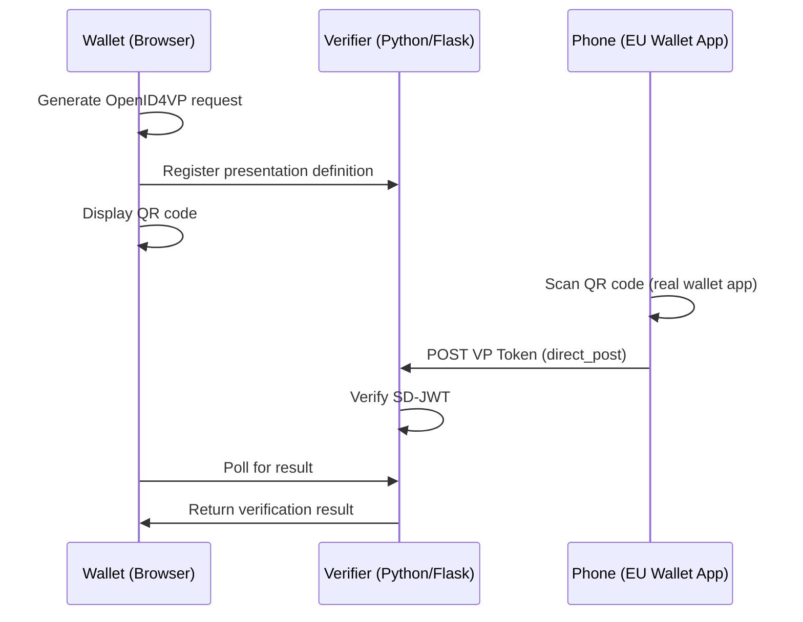

# 🔐 Real OpenID4VP Integration

This document describes how to evolve the eIDAS Wallet Demo from a simulated JSON-based
presentation flow to a **real OpenID4VP-compatible** implementation that can communicate with
actual EUDI Wallet apps.

---

## 📌 Current State (main branch)

| Feature | Status |
|---------|--------|
| QR Code Format | Custom JSON (`eidas-wallet-demo-v1`) |
| Cryptography | None (simulated) |
| Verifier | Same-browser, manual JSON paste |
| Can be scanned by real wallet apps? | ❌ No |

## 🎯 Target State

| Feature | Status |
|---------|--------|
| QR Code Format | **OpenID4VP Authorization Request** (standardized) |
| Cryptography | **SD-JWT** with ECDSA signatures (via WebCrypto API) |
| Verifier | Server-side verification endpoint (or same-browser) |
| Can be scanned by real apps? | ✅ Yes (EU Reference Wallet, future EUDI Wallets) |

---

## 🚧 Integration Plan

### Phase 1: SD-JWT Credential Format (estimated: 1-2 days)

Replace the current plain JSON credential with a proper **SD-JWT (Selective Disclosure JWT)**.

- [ ] Add JWT library (`jose` npm package) for signing/verification
- [ ] Define a proper credential payload conforming to ISO 18013-7 / W3C VC DM
- [ ] Issue signed SD-JWT credentials during issuance
- [ ] Implement selective disclosure: holder can choose which attributes to reveal
- [ ] Verifier validates the SD-JWT signature and disclosed attributes

```javascript
// Example SD-JWT payload
{
  "iss": "https://issuer.europa.eu",
  "sub": "did:example:wallet-id-123",
  "iat": 1680000000,
  "vc": {
    "@context": ["https://www.w3.org/2018/credentials/v1"],
    "type": ["VerifiableCredential", "EUDIPID"],
    "credentialSubject": {
      "given_name": "Jane",
      "family_name": "Doe",
      "birth_date": "1990-06-15",
      // ...
    }
  },
  "sd": ["given_name", "family_name", "birth_date"] // selectively disclosable
}
```

### Phase 2: OpenID4VP QR Code (estimated: 1-2 days)

Encode a proper **OpenID4VP Authorization Request** in the QR code instead of custom JSON.

- [ ] Generate OpenID4VP `authorization_request` URI with:
  - `response_type=vp_token`
  - `client_id` (verifier identifier)
  - `presentation_definition` (what attributes are requested)
  - `nonce` (anti-replay)
  - `response_mode=direct_post` or `response_mode=dc_api`
- [ ] Remove custom JSON format; replace with standards-compliant request

```
# OpenID4VP Authorization Request (in QR code)
openid4vp://authorize?response_type=vp_token
  &client_id=https://verifier.example.com
  &presentation_definition_uri=https://verifier.example.com/def
  &nonce=n-0S6_WzA2Mj
  &response_mode=dc_api
```

### Phase 3: Wallet Response Handling (estimated: 2-3 days)

Implement the wallet-side response handling — either same-browser or via a lightweight server.

#### Option A: Same-Browser Demo (easier, no server)



#### Option B: Lightweight Verifier Server (realistic flow)



### Phase 4: Real Device Testing (estimated: 1 day)

- [ ] Build and install **EU Reference Wallet** on Android/iOS
- [ ] Test our OpenID4VP QR code with the reference app
- [ ] Test with **Itsme** (already supports OpenID4VP)
- [ ] Validate end-to-end: Issuance → Storage → Presentation → Verification

---

## 🛠️ Technical Stack for Real Integration

| Component | Current (main) | Target (this branch) |
|-----------|---------------|---------------------|
| Credential Format | Plain JSON | **SD-JWT** / **ISO 18013-5 mdoc** |
| QR Content | Custom JSON | **OpenID4VP URI** |
| Signing | None | **ECDSA** (WebCrypto API) |
| JWT Library | None | **jose** (npm) |
| Verifier | Same-browser | **HTTP POST** (direct_post) |
| Backend (optional) | None | **Python/Flask** or **Node.js** |

---

## 📱 Compatible Real Apps

The following real-world apps would be able to scan an OpenID4VP-compliant QR code:

| App | Platform | OpenID4VP | Status |
|-----|----------|-----------|--------|
| **EU Reference Wallet** (Android) | Android (APK) | ✅ Full | [GitHub](https://github.com/eu-digital-identity-wallet/eudi-app-android-wallet-ui) |
| **EU Reference Wallet** (iOS) | iOS (TestFlight) | ✅ Full | [GitHub](https://github.com/eu-digital-identity-wallet/eudi-app-ios-wallet-ui) |
| **Itsme** (Belgium) | iOS + Android | ✅ Yes | App Store / Play Store |
| **Yivi** (Netherlands) | iOS + Android | ⏳ In Progress | [GitHub](https://github.com/privacybydesign/) |
| **EUDI Wallet Reference Verifier** | Android + iOS | ✅ Full | [GitHub](https://github.com/eu-digital-identity-wallet/eudi-app-multiplatform-verifier-ui) |

> ❌ **Not compatible:** AusweisApp Bund (Germany), France Identité — these use their own protocols
> and are not OpenID4VP-based wallets.

---

## 📚 References

- [OpenID4VP Specification](https://openid.net/specs/openid-4-verifiable-presentations-1_0.html)
- [SD-JWT Draft (IETF)](https://www.ietf.org/archive/id/draft-ietf-oauth-selective-disclosure-jwt-07.html)
- [EUDI Wallet ARF (Architecture Reference Framework)](https://github.com/eu-digital-identity-wallet/eudi-doc-architecture-and-reference-framework)
- [ISO/IEC 18013-7:2024](https://www.iso.org/standard/82720.html)
- [EU Reference Implementation - Android](https://github.com/eu-digital-identity-wallet/eudi-app-android-wallet-ui)
- [EU Reference Implementation - iOS](https://github.com/eu-digital-identity-wallet/eudi-app-ios-wallet-ui)
- [jose (JWT library for JavaScript)](https://github.com/panva/jose)
- [WebCrypto API (MDN)](https://developer.mozilla.org/en-US/docs/Web/API/WebCrypto_API)

---

## Getting Started (this branch)

```bash
# Switch to this branch
git checkout feature/real-openid4vp

# Install additional dependencies (when implemented)
npm install jose

# Start dev server
npm run dev
```

### How to test with a real wallet app (once implemented)

1. Build and install the EU Reference Wallet on your phone
2. Generate a credential in the demo (Issuance tab)
3. Navigate to Present tab → generate QR code
4. Open the EU Reference Wallet app on your phone
5. Scan the QR code
6. The wallet should display the requested attributes
7. Confirm sharing → verify the result in our Verifier tab
