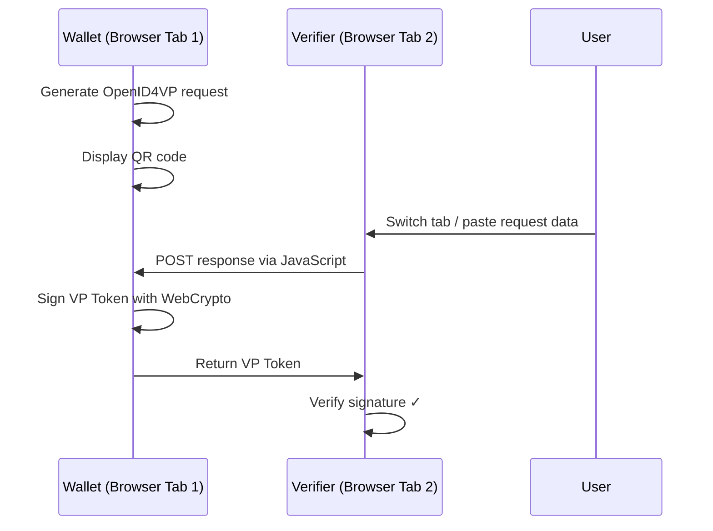
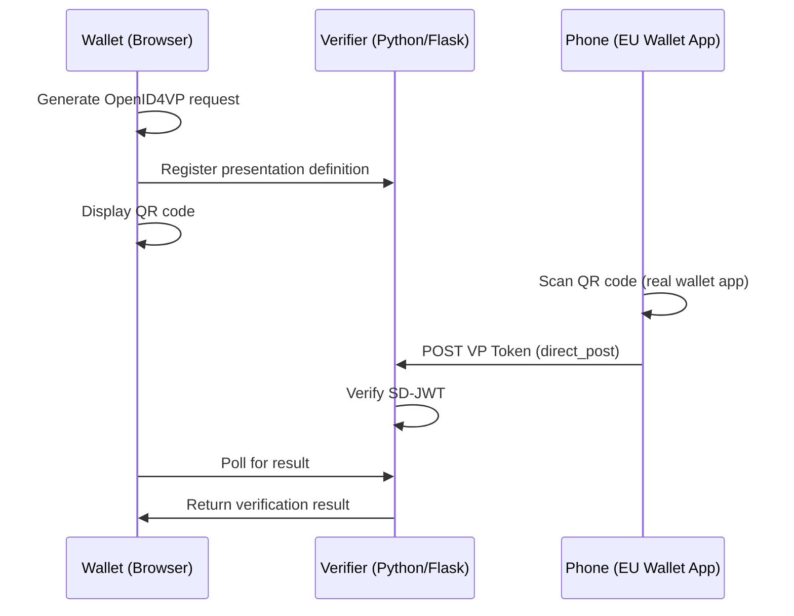
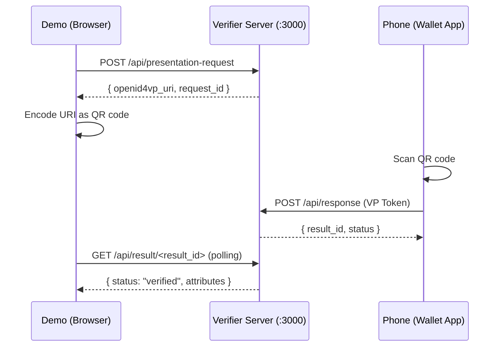

# 🔐 Real OpenID4VP Integration

This document describes how to evolve the eIDAS Wallet Demo from a simulated JSON-based
presentation flow to a **real OpenID4VP-compatible** implementation that can communicate with
actual EUDI Wallet apps.

---

## 📌 Current State (`main`)

All phases are **complete** and merged to `main`.

| Feature | Status |
|---------|--------|
| QR Code Format | **OpenID4VP URI** (when server running) / Custom JSON fallback |
| Cryptography | **SD-JWT** with ECDSA P-256 (WebCrypto + `jose`) |
| Verifier | Same-browser + **Flask server** (:3000) with VP validation |
| Can be scanned by real wallet apps? | ✅ Yes — start `python3 server/verifier.py` |
| E2E tests | **19 total** (13 browser + 6 server API) |

---

## 🚧 Integration Plan

### ✅ Phase 1: SD-JWT Credential Format (COMPLETE)

Replace the current plain JSON credential with a proper **SD-JWT (Selective Disclosure JWT)**.

- [x] Add JWT library (`jose` npm package) for signing/verification
- [x] Define a proper credential payload conforming to ISO 18013-7 / W3C VC DM
- [x] Issue signed SD-JWT credentials during issuance
- [x] Implement selective disclosure: holder can choose which attributes to reveal
- [x] Verifier validates the SD-JWT signature and disclosed attributes

```javascript
// Example SD-JWT payload
{
  "iss": "https://issuer.europa.eu",
  "sub": "did:example:wallet-id-123",
  "iat": 1680000000,
  "vc": {
    "@context": ["https://www.w3.org/2018/credentials/v1"],
    "type": ["VerifiableCredential", "EUDIPID"],
    "credentialSubject": {
      "given_name": "Jane",
      "family_name": "Doe",
      "birth_date": "1990-06-15",
      // ...
    }
  },
  "sd": ["given_name", "family_name", "birth_date"] // selectively disclosable
}
```

### Phase 2: OpenID4VP QR Code (status: partial)

The OpenID4VP Authorization Request URI is now generated **server-side** (Flask: `POST /api/presentation-request`).
The frontend (`QRDisplay.svelte`) **calls the server** when available and encodes the OpenID4VP URI
into the QR code. When the server is unavailable, it falls back to the custom JSON format.

**Frontend → Server integration:**
```
Browser (QRDisplay)  ─POST /api/presentation-request──→  Flask Server (:3000)
                     ←── { openid4vp_uri, request_id } ──
                     ── QR encodes openid4vp:// URI  ──→  Real wallet app can scan
```

- [x] Generate OpenID4VP `authorization_request` URI with:
  - `response_type=vp_token`
  - `client_id` (verifier identifier)
  - `presentation_definition` (what attributes are requested)
  - `nonce` (anti-replay)
  - `response_mode=direct_post` or `response_mode=dc_api`
- [ ] Remove custom JSON format completely (Phase 2c); currently fallback when server is down
- [x] QR display calls server when available; falls back to JSON gracefully
- [x] Badge shown: OpenID4VP ✅ or Fallback ⚠️
- [x] All E2E tests still pass (server unavailable → fallback JSON path)

```
# OpenID4VP Authorization Request (in QR code)
openid4vp://authorize?response_type=vp_token
  &client_id=https://verifier.example.com
  &presentation_definition_uri=https://verifier.example.com/def
  &nonce=n-0S6_WzA2Mj
  &response_mode=dc_api
```

### Phase 3: Wallet Response Handling (estimated: 2-3 days)

Implement the wallet-side response handling — either same-browser or via a lightweight server.

#### Option A: Same-Browser Demo (easier, no server)



#### Option B: Lightweight Verifier Server (realistic flow)



### Phase 4: Real Device Testing (estimated: 1 day)

- [ ] Build and install **EU Reference Wallet** on Android/iOS
- [ ] Test our OpenID4VP QR code with the reference app
- [ ] Test with **Itsme** (already supports OpenID4VP)
- [ ] Validate end-to-end: Issuance → Storage → Presentation → Verification

---

## 🛠️ Technical Stack for Real Integration

| Component | Current (main) | Target (this branch) |
|-----------|---------------|---------------------|
| Credential Format | Plain JSON | **SD-JWT** / **ISO 18013-5 mdoc** |
| QR Content | Custom JSON | **OpenID4VP URI** |
| Signing | None | **ECDSA** (WebCrypto API) |
| JWT Library | None | **jose** (npm) |
| Verifier | Same-browser | **HTTP POST** (direct_post) |
| Backend (optional) | None | **Python/Flask** or **Node.js** |

---

## 📱 Compatible Real Apps

The following real-world apps would be able to scan an OpenID4VP-compliant QR code:

| App | Platform | OpenID4VP | Status |
|-----|----------|-----------|--------|
| **EU Reference Wallet** (Android) | Android (APK) | ✅ Full | [GitHub](https://github.com/eu-digital-identity-wallet/eudi-app-android-wallet-ui) |
| **EU Reference Wallet** (iOS) | iOS (TestFlight) | ✅ Full | [GitHub](https://github.com/eu-digital-identity-wallet/eudi-app-ios-wallet-ui) |
| **Itsme** (Belgium) | iOS + Android | ✅ Yes | App Store / Play Store |
| **Yivi** (Netherlands) | iOS + Android | ⏳ In Progress | [GitHub](https://github.com/privacybydesign/) |
| **EUDI Wallet Reference Verifier** | Android + iOS | ✅ Full | [GitHub](https://github.com/eu-digital-identity-wallet/eudi-app-multiplatform-verifier-ui) |

> ❌ **Not compatible:** AusweisApp Bund (Germany), France Identité — these use their own protocols
> and are not OpenID4VP-based wallets.

---

## 📚 References

- [OpenID4VP Specification](https://openid.net/specs/openid-4-verifiable-presentations-1_0.html)
- [SD-JWT Draft (IETF)](https://www.ietf.org/archive/id/draft-ietf-oauth-selective-disclosure-jwt-07.html)
- [EUDI Wallet ARF (Architecture Reference Framework)](https://github.com/eu-digital-identity-wallet/eudi-doc-architecture-and-reference-framework)
- [ISO/IEC 18013-7:2024](https://www.iso.org/standard/82720.html)
- [EU Reference Implementation - Android](https://github.com/eu-digital-identity-wallet/eudi-app-android-wallet-ui)
- [EU Reference Implementation - iOS](https://github.com/eu-digital-identity-wallet/eudi-app-ios-wallet-ui)
- [jose (JWT library for JavaScript)](https://github.com/panva/jose)
- [WebCrypto API (MDN)](https://developer.mozilla.org/en-US/docs/Web/API/WebCrypto_API)

---

## 🖥️ Included: Lightweight Verifier Server

This branch includes a **Flask-based OpenID4VP Verifier Server** in `server/verifier.py`.

### Quick Start

```bash
# Terminal 1: Start the demo
cd eidas-wallet-demo
npm install
npm run dev

# Terminal 2: Start the verifier server
cd eidas-wallet-demo
pip install -r server/requirements.txt
python3 server/verifier.py
```

The server runs on `https://localhost:3000` with a self-signed cert.

### Flow



### Endpoints

| Method | Path | Description |
|--------|------|-------------|
| `POST` | `/api/presentation-request` | Register what the wallet wants to present |
| `POST` | `/api/response` | Wallet posts the VP Token here |
| `GET` | `/api/result/<id>` | Demo polls for the verification result |
| `GET` | `/api/presentation-request/<id>` | Check request status |
| `GET` | `/api/info` | Server connectivity check |

### Testing with Your Phone

1. Start the server → note the IP:
   ```bash
   ipconfig getifaddr en0  # macOS: find your local IP
   ```

2. In the demo, set the verifier URL to `https://192.168.x.x:3000`

3. Generate a credential → navigate to Present

4. Scan the QR code with your phone's camera (shows raw JSON) or with a real wallet app

## Getting Started (this branch)

```bash
# Switch to this branch
git checkout feature/real-openid4vp

# Install additional dependencies (when implemented)
npm install jose

# Install server dependencies
pip install -r server/requirements.txt

# Start dev server (Terminal 1)
npm run dev

# Start verifier server (Terminal 2)
python3 server/verifier.py
```

### How to test with a real wallet app

1. Build and install the **EU Reference Wallet** on your phone
   - Android: [eudi-app-android-wallet-ui](https://github.com/eu-digital-identity-wallet/eudi-app-android-wallet-ui)
   - iOS: [eudi-app-ios-wallet-ui](https://github.com/eu-digital-identity-wallet/eudi-app-ios-wallet-ui)

2. Or use an app that already supports OpenID4VP:
   - **Itsme** (Belgium) – Download from App Store / Google Play
   - **Yivi** (Netherlands) – Download "Yivi" from App Store / Google Play ([GitHub](https://github.com/privacybydesign/yivi-app-android))

3. Start both the demo and verifier server

4. Generate a credential in the demo (Issuance tab)

5. Navigate to Present tab → the QR code now contains an OpenID4VP URI

6. Open the wallet app on your phone → scan the QR code

7. The wallet should display the requested attributes → confirm sharing

8. The verifier server validates the presentation → result appears in the demo
